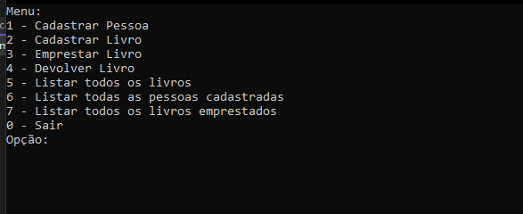
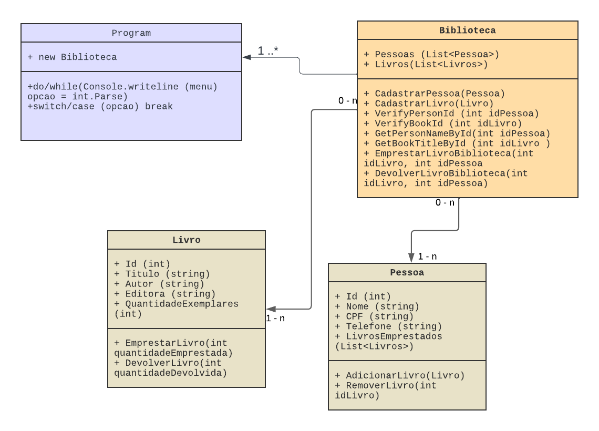

# Sistema-de-Biblioteca-Csharp

## Objetivo do projeto
O projeto foi realizado para compor nota de avaliação da trilha de aprendizado em Csharp, foi realizado em grupo e em forma de atividade com requisições dadas pelo professor (o arquivo com os detalhes do desafio está no repositório).

## Tecnologias
* [Visual Studio Community](https://visualstudio.microsoft.com/pt-br/vs/community/) - IDE de desenvolvimento
* [C#](https://learn.microsoft.com/pt-br/dotnet/csharp/) - Linguagem utilizada
* [.NET 6.0](https://dotnet.microsoft.com/en-us/download/dotnet/6.0) - Framework utilizada

## Modelagem de projeto

[Acesse pelo Lucid](https://lucid.app/lucidchart/719f1b78-dfb3-4abd-b3f6-2080114598e6/edit?viewport_loc=-1118%2C-968%2C2270%2C1038%2C0_0&invitationId=inv_ffb51ffc-f99a-4d01-a100-0695257cbe88) 

## Conceitos abordados 
Orientação à objeto em C#, estrutura condicional, gerenciamento de classes, uilização de atributos e construtores, manipulação de objetos com o uso de métodos, encapsulamento, composição de listas, passagem de parâmetros e chamada de métodos.

## Requisitos para o projeto funcionar
I. Ter a IDE Visual Studio Community instalado com as configurações necessárias para realizar projetos em C#;

 
II. Ter o Framework .NET 6.0 instalado; 

III. Fazer download do repositório, incluindo a solução (Sistema de Biblioteca.sln) e depois extrair para o local de sua preferência;

 IV. Abrir a pasta com do repositório (certifique-se que todos os arquivos e solução serão abertos);

  V. Clique em "Selecionar o Item de inicialização" e selecione o arquivo Sistema de Biblioteca.csproj;

   VI. Clique no botão Sistema de Biblioteca.csproj e o terminal com o menu interativo irá abrir, aproveite!

    
     Obs.: há casos em que a estrutura da linguagem não carrega se for aberto pela IDE, recomendo abrir os arquivos diretamente na pasta 
     
      ao invés de acessar pelo Visual Studio.

## Como acessar o código 
* [Código da Classe Biblioteca](https://github.com/giovannalogy/Sistema-de-Biblioteca-Csharp/blob/main/Biblioteca.cs)
* [Código da Classe Livro](https://github.com/giovannalogy/Sistema-de-Biblioteca-Csharp/blob/main/Livro.cs)
* [Código da Classe Pessoa](https://github.com/giovannalogy/Sistema-de-Biblioteca-Csharp/blob/main/Pessoa.cs)
* [Código da Classe Program](https://github.com/giovannalogy/Sistema-de-Biblioteca-Csharp/blob/main/Program.cs)

